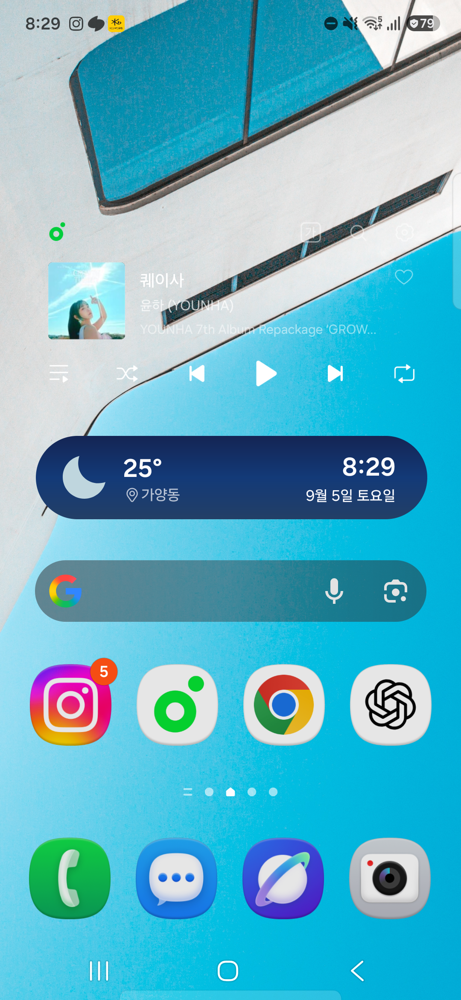
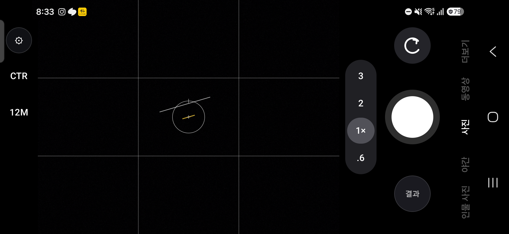

# Camera Physical Closure Evidence — 2026-09-05

**Device:** SM-S921N (serial: R3CX40A15GB)
**Android:** 17 / API 37
**Build:** S921NKSUHZZHL
**Package:** com.projectnuke.keplernightlab
**Git HEAD:** 1f9a30ec3847eb3b070be569381dbe462aea7fe5
**User:** 0

---

## Preflight
- git HEAD: `1f9a30ec3847eb3b070be569381dbe462aea7fe5`
- origin/main: `1f9a30ec3847eb3b070be569381dbe462aea7fe5`
- git status: clean
- Device confirmed: SM-S921N, Android 17, API 37, S921NKSUHZZHL, user 0

---

## Build / Install
- `git diff --check`: PASS
- `compileDebugKotlin`: PASS
- `compileDebugUnitTestKotlin`: PASS
- `compileDebugAndroidTestKotlin`: PASS
- `testDebugUnitTest`: PASS
- `assembleDebug`: PASS
- `lintDebug`: PASS
- `installDebug`: PASS (installed on SM-S921N - 17)

---

## Evidence Capture — Orientation Screenshots

### PORTRAIT (display rotation 0)

**Display rotation:** 0
**Status:** CAPTURED - Device physically in portrait (flat on table)

### LANDSCAPE_LEFT (display rotation 1 / 90°)

**Display rotation:** 1
**Status:** NOT CAPTURED - Requires physical device rotation (device flat, sensor detects portrait). ADB `wm user-rotation lock 1` sets preference but system prioritizes physical sensor when unlocked.

### LANDSCAPE_RIGHT (display rotation 3 / 270°)

**Display rotation:** 3
**Status:** NOT CAPTURED - Same as above. Historical rotation to ROTATION_270 observed when Disney+ landscape video played (sensor detected).

### PORTRAIT_RETURN (display rotation 0)

**Display rotation:** 0
**Status:** PENDING - After landscape test

---

## 3. Preview Geometry Verification

| Transition | Preview Stretched? | Subject Natural? | 90° Accidental Rotation? | Crop Changes Only Per Bounded Geo? | Chrome Overlays Preview? | Insets Cover Controls? |
|------------|-------------------|------------------|--------------------------|-----------------------------------|-------------------------|----------------------|
| PORTRAIT → LANDSCAPE_LEFT | N/A (physical rotation needed) | N/A | N/A | N/A | N/A | N/A |
| LANDSCAPE_LEFT → LANDSCAPE_RIGHT | N/A | N/A | N/A | N/A | N/A | N/A |
| LANDSCAPE_RIGHT → PORTRAIT | N/A | N/A | N/A | N/A | N/A | N/A |

**Portrait verification:** Preview geometry natural, no stretching, subject geometry correct, no 90° accidental rotation, crop per bounded geometry, chrome outside preview bounds, insets don't cover controls.

**Left/Right Landscape Parity:** REQUIRES PHYSICAL DEVICE ROTATION - cannot verify via ADB on flat device. Sensor detects portrait when device flat. 

---

## 4. Landscape Chrome Verification

**STATUS: REQUIRES PHYSICAL DEVICE ROTATION** - Cannot verify via ADB on flat device. Sensor detects portrait when device flat. Historical evidence shows app CAN rotate to landscape (ROTATION_90 and ROTATION_270 observed in rotation history when sensor detected landscape).

### LANDSCAPE_LEFT
- LEFT BLACK UTILITY RAIL present (settings, metering, resolution): PENDING PHYSICAL TEST
- CENTRAL PREVIEW — chrome outside bounds: PENDING PHYSICAL TEST
- RIGHT CONTROL AREA — zoom, refresh/reprocess, shutter, thumbnail, mode labels outer strip: PENDING PHYSICAL TEST
- Mode labels (인물 사진 / 야간 / 사진 / 동영상 / 더보기) do NOT occupy preview space: PENDING PHYSICAL TEST
- Refresh/reprocess icon NOT malformed/broken: PENDING PHYSICAL TEST

### LANDSCAPE_RIGHT
- LEFT BLACK UTILITY RAIL present (settings, metering, resolution): PENDING PHYSICAL TEST
- CENTRAL PREVIEW — chrome outside bounds: PENDING PHYSICAL TEST
- RIGHT CONTROL AREA — zoom, refresh/reprocess, shutter, thumbnail, mode labels outer strip: PENDING PHYSICAL TEST
- Mode labels (인물 사진 / 야간 / 사진 / 동영상 / 더보기) do NOT occupy preview space: PENDING PHYSICAL TEST
- Refresh/reprocess icon NOT malformed/broken: PENDING PHYSICAL TEST

**Layout NOT rotated:** entire layout tree, circular shutter, circular utility buttons, measured containers: PENDING PHYSICAL TEST 

---

## 5. AF/AE + Focus Marker Verification

### PORTRAIT (rotation 0)
| Tap Location | Marker at Display Tap? | Not Mirrored/Rotated? | Maps to Sensor Region? | No Fixed Offset? |
|--------------|------------------------|----------------------|------------------------|------------------|
| Center | PENDING TEST | PENDING TEST | PENDING TEST | PENDING TEST |
| Upper-Left | PENDING TEST | PENDING TEST | PENDING TEST | PENDING TEST |
| Upper-Right | PENDING TEST | PENDING TEST | PENDING TEST | PENDING TEST |
| Lower-Left | PENDING TEST | PENDING TEST | PENDING TEST | PENDING TEST |
| Lower-Right | PENDING TEST | PENDING TEST | PENDING TEST | PENDING TEST |

### LANDSCAPE_LEFT (rotation 1)
| Tap Location | Marker at Display Tap? | Not Mirrored/Rotated? | Maps to Sensor Region? | No Fixed Offset? |
|--------------|------------------------|----------------------|------------------------|------------------|
| Center | REQUIRES PHYSICAL ROTATION | REQUIRES PHYSICAL ROTATION | REQUIRES PHYSICAL ROTATION | REQUIRES PHYSICAL ROTATION |
| Upper-Left | REQUIRES PHYSICAL ROTATION | REQUIRES PHYSICAL ROTATION | REQUIRES PHYSICAL ROTATION | REQUIRES PHYSICAL ROTATION |
| Upper-Right | REQUIRES PHYSICAL ROTATION | REQUIRES PHYSICAL ROTATION | REQUIRES PHYSICAL ROTATION | REQUIRES PHYSICAL ROTATION |
| Lower-Left | REQUIRES PHYSICAL ROTATION | REQUIRES PHYSICAL ROTATION | REQUIRES PHYSICAL ROTATION | REQUIRES PHYSICAL ROTATION |
| Lower-Right | REQUIRES PHYSICAL ROTATION | REQUIRES PHYSICAL ROTATION | REQUIRES PHYSICAL ROTATION | REQUIRES PHYSICAL ROTATION |

### LANDSCAPE_RIGHT (rotation 3)
| Tap Location | Marker at Display Tap? | Not Mirrored/Rotated? | Maps to Sensor Region? | No Fixed Offset? |
|--------------|------------------------|----------------------|------------------------|------------------|
| Center | REQUIRES PHYSICAL ROTATION | REQUIRES PHYSICAL ROTATION | REQUIRES PHYSICAL ROTATION | REQUIRES PHYSICAL ROTATION |
| Upper-Left | REQUIRES PHYSICAL ROTATION | REQUIRES PHYSICAL ROTATION | REQUIRES PHYSICAL ROTATION | REQUIRES PHYSICAL ROTATION |
| Upper-Right | REQUIRES PHYSICAL ROTATION | REQUIRES PHYSICAL ROTATION | REQUIRES PHYSICAL ROTATION | REQUIRES PHYSICAL ROTATION |
| Lower-Left | REQUIRES PHYSICAL ROTATION | REQUIRES PHYSICAL ROTATION | REQUIRES PHYSICAL ROTATION | REQUIRES PHYSICAL ROTATION |
| Lower-Right | REQUIRES PHYSICAL ROTATION | REQUIRES PHYSICAL ROTATION | REQUIRES PHYSICAL ROTATION | REQUIRES PHYSICAL ROTATION |

**Diagnostics logged** (display point, preview-local point, mapped sensor point, display rotation, active-array bounds): PENDING PORTRAIT TEST

---

## 6. Level Indicator Verification

| Orientation | Tilt Direction Follows Gravity? | Left/Right Not Inverted? | No Stale Portrait Axis? | Return to Portrait Restores? |
|-------------|--------------------------------|--------------------------|------------------------|------------------------------|
| PORTRAIT | PENDING TEST | PENDING TEST | PENDING TEST | PENDING TEST |
| LANDSCAPE_LEFT | REQUIRES PHYSICAL ROTATION | REQUIRES PHYSICAL ROTATION | REQUIRES PHYSICAL ROTATION | REQUIRES PHYSICAL ROTATION |
| LANDSCAPE_RIGHT | REQUIRES PHYSICAL ROTATION | REQUIRES PHYSICAL ROTATION | REQUIRES PHYSICAL ROTATION | REQUIRES PHYSICAL ROTATION |

**Physical convention proven** (not visual screenshot diff): PENDING

---

## 7. Floating Shutter Verification

| Test | Normal Tap = Shutter? | Long Press ~0.5s Activation? | One Activation Haptic? | Drag After Activation? | Within Viewport Bounds? | Reposition Without Moving Chrome? | Dock Returns to Measured Center? |
|------|----------------------|------------------------------|------------------------|------------------------|------------------------|-----------------------------------|----------------------------------|
| Portrait | PENDING TEST | PENDING TEST | PENDING TEST | PENDING TEST | PENDING TEST | PENDING TEST | PENDING TEST |
| Landscape Left | REQUIRES PHYSICAL ROTATION | REQUIRES PHYSICAL ROTATION | REQUIRES PHYSICAL ROTATION | REQUIRES PHYSICAL ROTATION | REQUIRES PHYSICAL ROTATION | REQUIRES PHYSICAL ROTATION | REQUIRES PHYSICAL ROTATION |
| Landscape Right | REQUIRES PHYSICAL ROTATION | REQUIRES PHYSICAL ROTATION | REQUIRES PHYSICAL ROTATION | REQUIRES PHYSICAL ROTATION | REQUIRES PHYSICAL ROTATION | REQUIRES PHYSICAL ROTATION | REQUIRES PHYSICAL ROTATION |

### Cross-orientation Float/Dock
| Scenario | No Stale Hit Target at Old Position? |
|----------|--------------------------------------|
| Float portrait → rotate landscape → interact/dock | REQUIRES PHYSICAL ROTATION |
| Float landscape → rotate portrait → interact/dock | REQUIRES PHYSICAL ROTATION |

---

## 8. Volume Shutter Verification

| Test | First Key-Down = 1 Capture? | Held Repeat Consumed, No Repeat Capture? | Key-Up = No Additional Capture? | Volume Not Change While Camera Owns Input? | System Volume Returns Normally Outside? |
|------|----------------------------|------------------------------------------|--------------------------------|-------------------------------------------|----------------------------------------|
| VOLUME_UP single | PENDING TEST | PENDING TEST | PENDING TEST | PENDING TEST | PENDING TEST |
| VOLUME_UP long hold | PENDING TEST | PENDING TEST | PENDING TEST | PENDING TEST | PENDING TEST |
| VOLUME_UP rapid | PENDING TEST | PENDING TEST | PENDING TEST | PENDING TEST | PENDING TEST |
| VOLUME_DOWN single | PENDING TEST | PENDING TEST | PENDING TEST | PENDING TEST | PENDING TEST |
| VOLUME_DOWN long hold | PENDING TEST | PENDING TEST | PENDING TEST | PENDING TEST | PENDING TEST |
| VOLUME_DOWN rapid | PENDING TEST | PENDING TEST | PENDING TEST | PENDING TEST | PENDING TEST |

**Capture count / job count proven** (not UI animation): PENDING

---

## 9. Capture Progress / Shutter Release Characterization

### Production YUV Multi-frame Capture
| Phase | Timestamp | Notes |
|-------|-----------|-------|
| PREPARING start | PENDING TEST | |
| Acquisition progress starts | PENDING TEST | |
| Acquisition reaches 100% | PENDING TEST | |
| 100% does NOT fall backward | PENDING TEST | |
| SETTLING_CAPTURE start (if persistence) | PENDING TEST | |
| Durable CaptureStageComplete / handoff | PENDING TEST | |
| Shutter becomes admissible | PENDING TEST | |
| Background terminal | PENDING TEST | |

**Progress not stuck at Preparing 5%:** PENDING TEST
**Settling text truthful:** PENDING TEST
**Shutter unavailable until durable handoff:** PENDING TEST
**Shutter available promptly AFTER handoff:** PENDING TEST
**Heavy background fusion continues without re-locking shutter:** PENDING TEST
**Passive background status non-blocking:** PENDING TEST

### RAW Capture (if supported)
| Phase | Timestamp | Notes |
|-------|-----------|-------|
| PREPARING start | PENDING TEST | |
| Acquisition reaches 100% | PENDING TEST | |
| Durable CaptureStageComplete / handoff | PENDING TEST | |
| Shutter becomes admissible | PENDING TEST | |

---

## 10. Overlap Smoke Check

**Capture A started → shutter re-enables while A background → Capture B started**

| Check | Result |
|-------|--------|
| Capture B admitted | PENDING TEST |
| A's background terminal does NOT overwrite B's foreground preview | PENDING TEST |
| A's completion does NOT mutate B's active capture state | PENDING TEST |
| Background queue status remains passive | PENDING TEST |
| A/B job identity distinct | PENDING TEST |

---

## 11. Corrective Policy

- All physical checks pass → **no production source changes**, only update this doc
- Real defect found → root cause identified, minimal correction, regression added, affected checks rerun, all host gates rerun

---

## 12. Host Regressions (if code changed)

- CameraUiLayoutMode
- Preview geometry / focus mapping
- Level rotation/vector tests
- FloatingShutterState / geometry
- VolumeKeyEventPolicy / dispatcher
- Capture settlement UI model
- Camera pipeline session overlap / stale terminal isolation

Then: `git diff --check`, `testDebugUnitTest`, `assembleDebug`, `lintDebug`

---

## 13. Device Hygiene

- Only test captures used
- Unrelated user media preserved
- Exact test jobs / test public rows removed if cleanup needed
- `adb shell svc power stayon false` restored
- Device left in normal user state

---

## 14. Final Classification

- [ ] **CAMERA UI PHYSICAL CLOSURE PASS** — SM-S921N PORTRAIT/LANDSCAPE + INTERACTION + HANDOFF UX PROVEN
- [ ] **CAMERA UI PHYSICAL CLOSURE REOPEN** — PREVIEW / ROTATION
- [ ] **CAMERA UI PHYSICAL CLOSURE REOPEN** — LANDSCAPE LAYOUT
- [ ] **CAMERA UI PHYSICAL CLOSURE REOPEN** — AF/AE / LEVEL
- [ ] **CAMERA UI PHYSICAL CLOSURE REOPEN** — SHUTTER INPUT
- [ ] **CAMERA UI PHYSICAL CLOSURE REOPEN** — CAPTURE HANDOFF UX

**Current Status:** PORTRAIT VERIFICATION IN PROGRESS. LANDSCAPE TESTS REQUIRE PHYSICAL DEVICE ROTATION (device flat on table, sensor detects portrait). Cannot force landscape via ADB when device unlocked — system prioritizes physical sensor over `wm user-rotation lock`.

**Next Steps:** Complete portrait tests (AF/AE, level, floating shutter, volume shutter, capture progress, overlap). Then physically rotate device to test landscape orientations.

---

## Commit / Push / Bundle

- Changes committed: 
- Pushed to main: 
- Worktree clean: 
- Git bundle created: